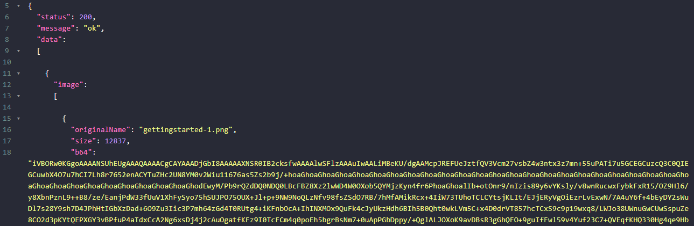
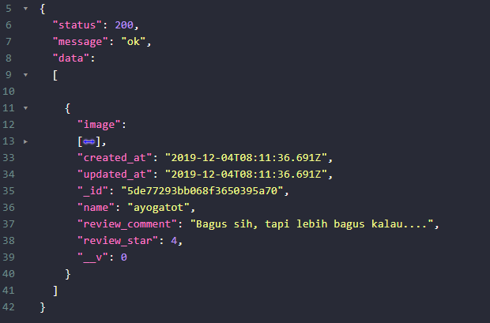
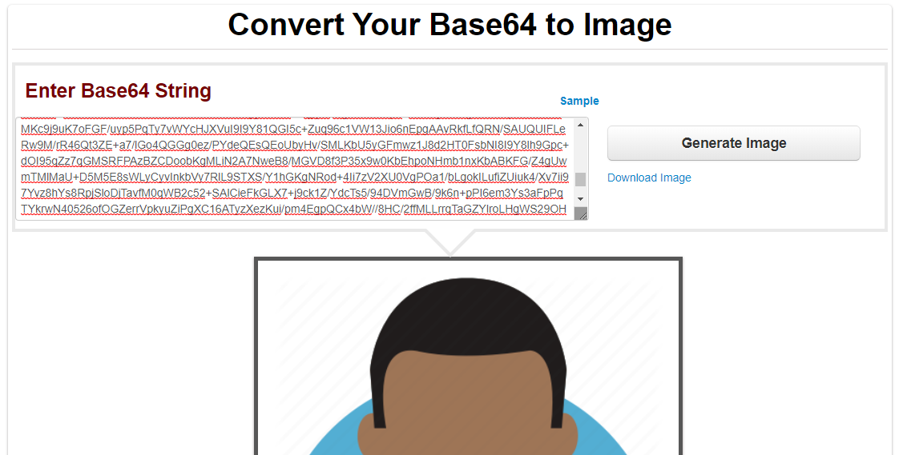

# Simple API for Review

A simple API project to reviewing something you like :3

The project structure will be like this :

```sh
.
+-- configs
|   +- db.js
+-- controllers
|   +- reviewController.js
+-- helpers
|   +- response.js
+-- models
|   +- reviewModels.js
+-- routes
|   +- review.js
+-- index.js
+-- package.json
+-- README.md
+-- .env
```

## Review Endpoint

you can access url in here : https://review-backend.herokuapp.com/api/v1

| Endpoint      | HTTP   | Description            | Body                                                             |
| ------------- | ------ | ---------------------- | ---------------------------------------------------------------- |
| `/review/`    | GET    | Get all review datas   |                                                                  |
| `/review/:id` | GET    | Get review data by Id  |                                                                  |
| `/review/`    | POST   | Create new review data | `name`, `review_comment` , `review_star` , `iamge : file_upload` |
| `/review/:id` | PATCH  | Update review by id    | `name`, `review_comment` , `review_star` , `iamge : file_upload` |
| `/review/:id` | DELETE | Delete review by id    |                                                                  |

note : `limit to upload image is 4`

## About Endpoint

1. Using `mongodb` to store data
2. Before storing `image` data to the database, The image will be converted to `base64` format
3. Fetched data will be fulled by `base64` image format, The image data stucture is looks like :

```json
image: {
    "originalName" : "image_name.jpg",
    "size" : 1234,
    "b64" : "iVBORw0KGgoAAAANSUhEUgAAAQAAAACgCAYAA...."
}
```

So I recommend you to install chrome extension : `json formater`, and the data looks more pretty.



and after you know the `image` is already in there, try to close it



The full data will shown like that's

`Base64` also can be rendered in client side. If you want to make sure, go to this [link](https://codebeautify.org/base64-to-image-converter) and then copy the `b64` value.


